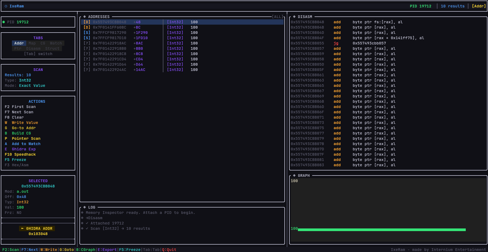

# ⬡ IxeRam



**IxeRam** is a high-performance, terminal-native memory scanner and debugger for Linux. It provides a "Cheat Engine-like" experience for developers and reverse engineers who prefer the terminal or work over SSH.

## 🚀 Why IxeRam?

Unlike traditional GUI-based tools, IxeRam is designed for speed, low overhead, and massive scale.

*   **Multi-Threaded Engine:** Parallelized memory scanning that utilizes all available CPU cores for lightning-fast results.
*   **Asynchronous UI:** A non-blocking terminal interface that stays responsive even during multi-gigabyte scans.
*   **Zero Dependencies (Self-Contained):** Static builds for FTXUI, Capstone, and Keystone. No manual library management.
*   **Ghidra Workflow Integration:** Sync ImageBase with Ghidra and export Python scripts to label your discovered addresses automatically.
*   **Kernel-Level Speed:** Uses `process_vm_readv` and `process_vm_writev` for high-speed direct memory access.

## 🛠️ Key Features

- 🔍 **Advanced Memory Scanner**: 
    - Support for Int8/16/32/64, Float, Double, Strings, and AOB (Array of Bytes) with wildcards.
    - **Multi-threaded** search and refinement.
    - Real-time value tracking with color-coded changes (Red = Up, Blue = Down).
- 🧩 **Static Pointer Discovery**: Find pointer paths that persist across process restarts (multi-level pointer scanning).
- ⚡ **Interactive Dizassembelr**: Real-time x86-64 disassembly with syntax highlighting and jump-to-address support.
- 🛠️ **Live Patching**: Write assembly instructions directly into memory using the integrated **Keystone Engine**.
- 📐 **Structure Dissector**: Visualize memory regions as complex structures with real-time value updates.
- ⛓️ **Call Graph Analysis**: Heuristic-based call graph construction for analyzing function flows and identifying logic.
- ❄️ **Memory Freezing**: Lock values in memory to prevent the process from changing them.
- 📤 **Data Export**: Export results to JSON or Ghidra Python scripts for automation.
- 🕒 **Integrated Speedhack**: Control the flow of time via `LD_PRELOAD` shared memory config.

## 🏁 Getting Started

### Prerequisites
- C++17 compatible compiler (`g++` or `clang++`)
- `cmake` (version 3.14+)
- `git`

### Build and Install
IxeRam uses a "batteries included" build system. It will automatically fetch and statically link all dependencies.

```bash
# Clone and enter the directory
git clone https://github.com/Internium-Entertainment/IxeRam.git
cd IxeRam

# Build the project
cmake -B build -S .
cmake --build build -j$(nproc)
```

### Usage
Run with root privileges (required for `process_vm_readv`):

```bash
sudo ./build/memdebug
```

#### Using the Speedhack
1. Launch your target app with the library: `LD_PRELOAD=./build/libspeedhack.so ./your_target_app`
2. In IxeRam, press **F10** to set the time multiplier.

## ⌨️ Default Keybindings

| Key | Action |
|-----|--------|
| **Tab** | Cycle through views (Addresses, Map, Call Graph, Watch, Pointers, Disasm, Struct) |
| **F2** | Open Initial Scan Modal |
| **F7** | Open Next Scan (Filter) Modal |
| **F8** | Clear all scan results |
| **F4** | Attach to a Process (PID) |
| **W** | Write New Value to selected address |
| **G** | Go to specific Memory Address |
| **A** | Add selected address to Watchlist |
| **P** | Run Pointer Scanner on selected address |
| **B** | Build Call Graph from selected instruction |
| **X** | Export Results to JSON |
| **E** | Export Results to Ghidra Script |
| **Space** | (In Disasm) Patch with Assembly or Hex bytes |
| **F5** | Freeze/Unfreeze value at current address |
| **F10**| Set Speedhack Multiplier |
| **F11**| Pause/Resume Target Process |
| **F12**| Kill Target Process |
| **Q** | Clean Quit (Detaches safely) |

## 📐 Architecture
- **Scanner.cpp**: Multi-threaded scanning logic using `std::future` and `std::async`.
- **MemoryEngine.cpp**: Linux syscall wrappers and process management.
- **TUI_run.cpp**: Main UI loop using FTXUI with virtual list optimizations for handling 1M+ results.
- **speedhack.c**: Shared library for `LD_PRELOAD` time manipulation.

## 📜 License
IxeRam is dual-licensed:
1. **GNU AGPLv3** for open-source and non-commercial use.
2. **InterXlicense v1.0** for commercial deployments.

Made with 💜 by **myster_gif** @ **Internium Entertainment**.
